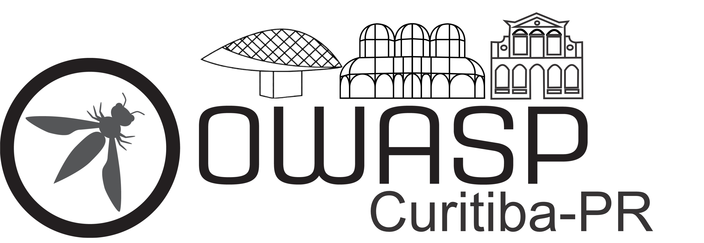

---

layout: col-sidebar
title: OWASP Curitiba
tags: example-tag
level: 1
meetup-group: owasp-curitiba-chapter
country: Brazil
region: South America

---

## Seja Bem Vindo ao capítulo OWASP Curitiba

A OWASP Curitiba é um dos capítulos do Brasil, entre os mais de 200 capítulos que estarão ocorrendo em todo o mundo, o capítulo OWASP Curitiba vem com o objetivo de:

- Compartilhar a missão da Instituição OWASP;

- Divulgar os trabalhos da Fundação;

- Propor eventos para as comunidades acadêmicas e profissionais;

- Proporcionar a troca de conhecimentos;

- Trocar experiências. 

## Sobre a OWASP

Open Worldwide (OWASP) é uma organização sem fins lucrativos que trabalha para melhorar a segurança do software. Todos os projetos, ferramentas, documentos, fóruns e capítulos são gratuitos e abertos a qualquer pessoa interessada em melhorar a segurança das aplicações.

Segue uma lista de 6 (alguns de muitos) projetos da comunidade

  - Top 10 2021 <https://owasp.org/Top10/>
  - OWASP Mobile Security Project
    <https://owasp.org/www-project-mobile-security/>
  - OWASP Internet of Things Project
    <https://owasp.org/www-project-internet-of-things/>
  - OWASP Cloud Security Project
    <https://owasp.org/www-project-cloud-security/>
  - OWASP API Security Project
    <https://owasp.org/www-project-api-security/>
  - OWASP Broken Web Applications Project
    <https://owasp.org/www-project-broken-web-applications/>
  - Conheça os outros projetos
    <https://owasp.org/projects/>

## I Meetup Owasp Curitiba de 2023



O capítulo OWASP Curitiba convida profissionais de segurança da informação, desenvolvedores de software, estudantes das áreas de tecnologia da informação e demais interessados no assunto, para participarem do nosso meetup virtual dia 03 de Maio de 2023 as 20 horas.

Evento online

Link de transmissão:https://www.youtube.com/

Meetup: https://www.meetup.com/owasp-curitiba-chapter/
